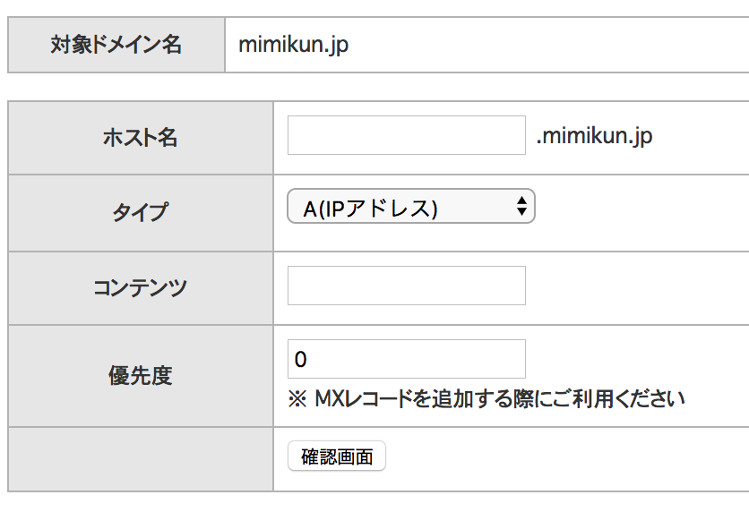
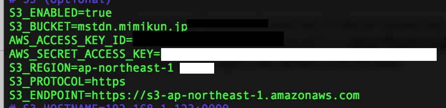
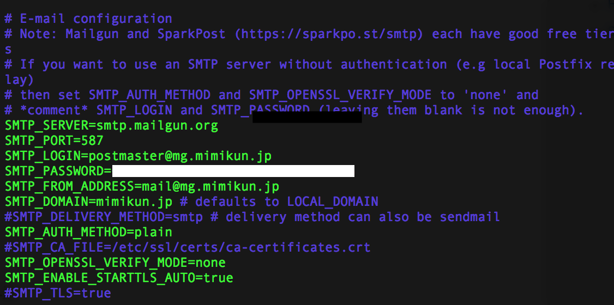

# 全くの素人がConoHaとS3でMastodonインスタンスを立ててみたお話

実際に完成したものは[mimikun丼](https://mstdn.mimikun.jp)になります。
作業内容をメモしていなかったので忘れている部分もありますがご了承ください

今回はConoHa公式のMastodonイメージは使っていません。

## 環境など
+ macOS 10.13
+ ConoHa VPS 1GB (Ubuntu16.04)
+ Amazon S3
+ Mailgun
+ スタードメイン

## 手順

### 1. ドメインの設定
インスタンスを立てるにあたってドメインが必要なのですが、持っていなかったので取得しました。
whois情報が出ないところが良かったのでスタードメインで取得しました。

### 2. DNSレコードの設定
スタードメインの場合、自分には分かりにくかったのでちょっと詰まりました。
(お名前やムームーはもう少し分かりやすいんでしょうか？)

ドメインのDNSレコード設定


上から、例えば自分だったら

| 項目名     | 入力値     |
| :------------- | :------------- |
|    ホスト名    | mstdn.(mimikun.jp)       |
| タイプ | タイプA |
|   コンテンツ   | ConoHaのVPSのIPアドレス       |
| 優先度 | (MXレコードではないので、空白) |

といった感じに設定しました。

### 3. VPSへのSSHログイン設定
ここで1〜2日かかってしまいました。
ファイルのパーミッション周りの設定が分かってなかったことが原因でした。
最終的にはこんな感じになりました。

1. ホスト(Mac)の`~/.ssh/config`ファイルを以下のようにして簡単に接続できるようにする

```
#ConoHa
Host conoha.hogefuga
  HostName 123.456.789.012
  User hogefuga
  Port 22
  IdentityFile ~/.ssh/id_rsa
```

2. パーミッションを適切に設定する
僕の場合はユーザをrootの他にも作ったのでそのユーザのssh鍵に対しても行いました。

```
$ sudo chmod -R 700 ~/.ssh/
$ sudo chmod 600 ~/.ssh/authorized_keys
```

### 4. VPS(Ubuntu)の更新
いつものようにコマンドを入力します。

```
$ sudo apt-get update
```

言語設定も日本語にしておきましょう。僕は後から行ったので英語が読めず、エラーメッセージをその都度Google翻訳にかけるなど無駄な時間を過ごしてしまいました。
さらにcertbotを入れる時、python virtualenv作成がうまく行かなかったということも起きました。

```
$ sudo apt-get install language-pack-ja
$ sudo update-locale LANG=ja_JP.UTF-8
```

入力後、Cmd+Dでログアウト、再ログインします。

エラー`sudo: unable to resolve host 123-456-789-012` が起きないようにする

`/etc/hosts` に以下のように追記します。

```
127.0.0.1	localhost     # 元からあった
127.0.1.1	ubuntu        # 元からあった
127.0.0.1 123-456-789-012    # 追記した
```


### 5. オブジェクトストレージ(Amazon S3)の設定
ConoHaのオブジェクトストレージを使うという手もありましたが、公式にある通りAmazon S3を使いました。

~決して構築が面倒くさかったからではない。いいね？~

AWSの設定方法や登録方法はググればたくさん出てくると思うので省きます。

終わったら、`.env.production`のS3の部分を以下のように編集します。



### 6. Mailgunの設定
ConoHaのメールサーバを使うという手もありましたが、公式の`.env.production`にある通り、Mailgunを使いました。

~決して(以下略~

Mailgunの設定をします。

1. 登録
2. メール認証
2. ドメイン設定
3. DNSレコード設定
4. 1~2日待機
5. ドメイン認証

という順番で行いました。

DNSレコード設定は以下のような感じにしました。



そして、`.env.production`のmail部分を以下のように編集します。


### 7. SSL証明書の取得
certbotで取得しました。
証明書が切れそうになった時、メールで通知がくるのでよく使うメールアドレスを設定しておくといいです。

生成にはこのコマンドを使います。
```
./certbot-auto certonly --standalone -d [Mastodonのドメイン] -m [よく使うメアド] --agree-tos -n
```

### 8. nginxの設定
の項目を見て設定しました。

この時、serverディレクティブに以下の7行を追加します。何故かProductionガイドから消されていたようです。

```
ssl_protocols TLSv1.2;
ssl_ciphers HIGH:!MEDIUM:!LOW:!aNULL:!NULL:!SHA;
ssl_prefer_server_ciphers on;
ssl_session_cache shared:SSL:10m;

ssl_certificate     /etc/letsencrypt/live/example.com/fullchain.pem;
ssl_certificate_key /etc/letsencrypt/live/example.com/privkey.pem;
```

### 9. dockerイメージ作成

を見てやりました。

### 終わりに
今回インスタンスを立てるにあたり色々助言してくれた[:don:](https://mstdn.maud.io)の方々、ありがとうございました。
この場を借りてお礼申し上げます。
